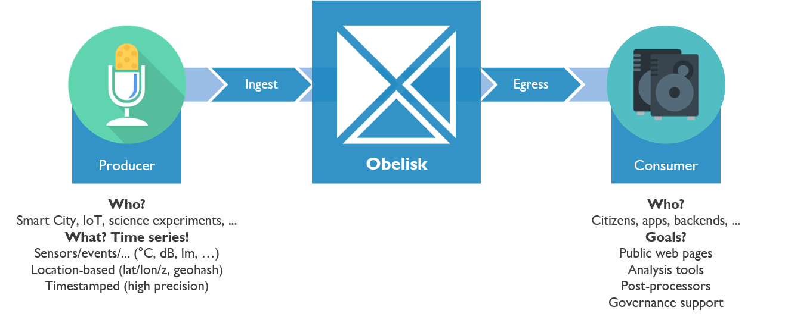

# Introduction

## Overview
Obelisk is a service platform for building scalable data-driven applications and services, connecting data producers and consumers with powerful APIs for ingesting, querying and streaming large amounts of data in an organized and secure way.

Obelisk's ambition is to become a reliable building block for technical solutions in need of a system for managing large amounts of (event-based[^1]) data. By taking care of storage, data management (e.g. discoverability, access control) and interfacing, Obelisk allows the developers of these solutions to focus on the unique challenges of the use case at hand instead of spending time and effort taking care of the data logistics.

## Features

- [x] **Scalable data backend** built using industry-proven technologies such as [Kubernetes](https://kubernetes.io/), [Apache Pulsar](https://pulsar.apache.org/), [Redis](https://redis.io/) and [Clickhouse](https://clickhouse.tech/).
- [x] **Powerful APIs**: ingest, query, stream and export large amounts of data using the efficient Obelisk HTTP-based APIs, or interface with the same data using Open Standards such as [NGSI-LD](https://www.etsi.org/committee/cim) or [DCAT](https://www.w3.org/TR/vocab-dcat-2/).
- [x] **Security-aware architecture**: Data Isolation is a first-class citizen. Authentication and authorization are implemented using open standards ([OpenID Connect](https://openid.net/connect/), [OAuth 2.0](https://oauth.net/2/)).
- [x] **Accessible, Easy to use**: the Obelisk Catalog UI allows users to quickly discover relevant Datasets, view meta-data, request access, manage API clients, etc...

## Getting started
[IDLAB](https://idlab.technology) is hosting a managed version of the Obelisk platform at {{extra.obelisk.url}}. You can signup using an OpenID Provider (e.g. using your Google account) and start evaluating the platform today!

!!! danger "Disclaimer"
    The managed instance of Obelisk, running on [IDLAB](https://idlab.technology)'s infrastructure, may only be used for research and non-commercial activities.

### For regular users

1. Start by browsing the Catalog to discover available Datasets.
2. Visit the demo Dataset (accessible to all Users).
3. Read the [Concepts](concepts.md) page to get a better understanding of some of the Obelisk concepts and features.

### For developers

1. Also read the [technical documentation](tech_reference/data_format.md) and [guides](guides/auth.md). A complete API overview is available at {{extra.apidocs.url}}.  
3. Create your own Dataset to start producing and consuming your data.

## History
Development on Obelisk started in 2018 at [IDLAB](https://idlab.technology), with the goal of consolidating various research tracks in the domain of Internet of Things, Industry 4.0 and Machine Learning, into a single platform capable of providing the infrastructure required to enable research at scale in these domains.

Our goal is to continue to support and expand the Obelisk platform for internal use (at [IDLAB](https://idlab.technology), [IMEC](https://www.imec.be/nl), [Ghent University](https://www.ugent.be/)) and to open up the platform for external use in the future.

 

[^1]: Obelisk is optimized for handling event-based data: data that has been generated at a certain moment in time and thus includes a timestamp.

--8<-- "snippets/glossary.md"